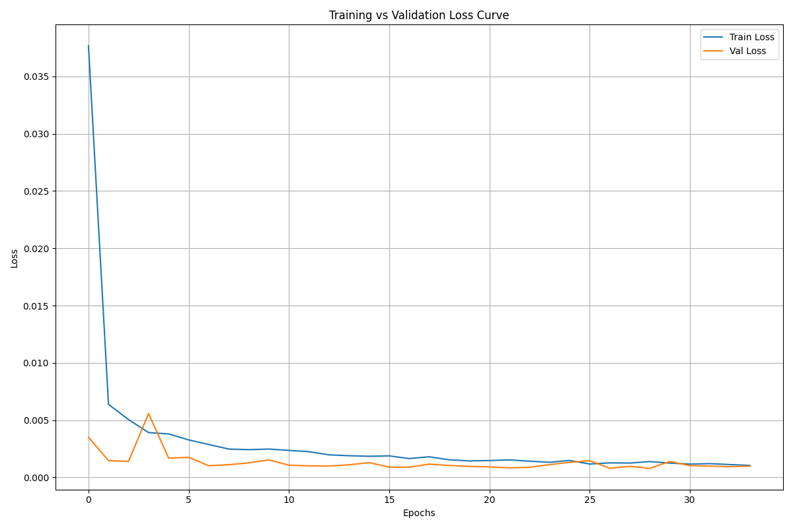
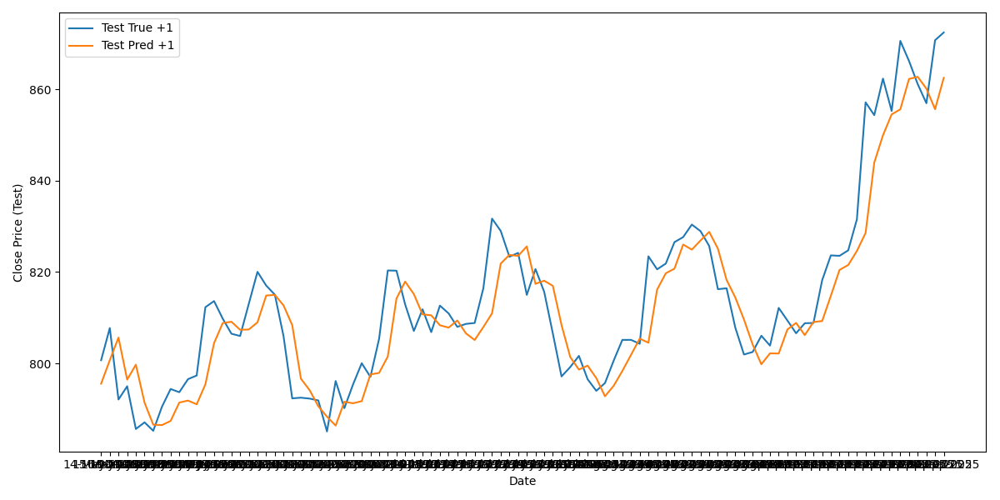

### 🧠 Time Series Forecasting Using Simple RNN: A Step-by-Step Guide

---

#### 🗂️ Overview

Recurrent Neural Networks (RNNs) are a class of neural networks specifically designed for sequence modeling. Unlike traditional Artificial Neural Networks (ANNs) which process data in a fixed input-output manner, RNNs have loops that allow information to persist, making them well-suited for sequential and time-dependent data.

### Why Not Use ANN for Sequential Data?

* ANNs treat inputs independently and lack memory of previous inputs.
* The order of data points in ANNs doesn’t influence predictions, which is a critical drawback for time series data.
* ANNs cannot effectively model temporal dependencies or patterns over time.

### What Makes RNNs Suitable?

* RNNs maintain an internal state that can capture information about previous inputs.
* They are capable of learning temporal dynamics and dependencies within sequences.
* This makes them ideal for forecasting tasks, like stock price prediction, where past trends influence future outcomes.

---

### In This App

* We build a **Simple RNN** using Keras to forecast the next day’s closing price of stocks.
* The app covers data transformation, scaling, model building, training, evaluation, and visualization.
* You'll get an interactive dashboard to fetch stock data, view price trends, and predict future prices with an intuitive UI.


---

### 🔧 Step 1: Data Preparation

#### Split the Data

We begin by splitting the dataframe `df` into training (70%), validation (20%), and testing (10%) sets:

```python
train_df = df[0:int(n*0.7)]
val_df = df[int(n*0.7):int(n*0.9)]
test_df = df[int(n*0.9):]
```

---

#### Scale the Data

We scale features using `MinMaxScaler` to normalize values between 0 and 1:

```python
scaler = MinMaxScaler(feature_range=(0, 1))
train_scaled = scaler.fit_transform(train_df.values)
val_scaled = scaler.transform(val_df.values)
test_scaled = scaler.transform(test_df.values)
```

---

### 📏 Step 2: Sequence Creation

Using a custom function, we convert the time series into sequences of input-output pairs:

```python
def create_multivariate_sequences(data_array, lookback, horizon):
    # Returns X: (num_seq, lookback, n_features) and y: (num_seq, horizon)
```

With `lookback=20` and `horizon=5`, we train the model to predict the next 5 steps from the last 20.

---

### 🏗️ Step 3: Build the Simple RNN

We use a `SimpleRNN` layer followed by dropout and dense layers. The final layer outputs 5 values:

```python
model = Sequential([
    SimpleRNN(64, activation='tanh', input_shape=(lookback, num_features)),
    Dropout(0.3),
    Dense(32),
    Dense(horizon)
])
```

The model uses the Adam optimizer and is compiled with **MAE and MSE** as loss functions and metrics:

```python
model.compile(optimizer='adam', loss='mse', metrics=['mae', 'mse'])
```

---

### 🧪 Step 4: Model Training

We apply early stopping to prevent overfitting and log training with TensorBoard:

```python
early_stop_callback = EarlyStopping(monitor='val_loss', patience=10, restore_best_weights=True)
```

Model training:

```python
history = model.fit(X_train, y_train, validation_data=(X_val, y_val), epochs=100, batch_size=32, callbacks=[tensorboard_callback, early_stop_callback])
```

---

### 💾 Step 5: Save Model & Training History

We save both model and training history for later analysis:

```python
model.save('simple_rnn_base.h5')
pd.DataFrame(history.history).to_csv("output/SimpleRNN_training_history.csv")
```

---

### 📉 Step 6: Visualize Loss

We plot training vs validation loss curves:

```python
plt.plot(history.history['loss'], label='Train Loss')
plt.plot(history.history['val_loss'], label='Val Loss')
```



---

### 🔍 Step 7: Predictions and Inverse Scaling

Predictions are made and then inverse transformed using a custom function:

```python
y_test_pred_inv = invert_scale(y_pred_test, X_test, scaler, target_index=0)
```

---

### 📈 Step 8: Visualize Predictions

#### Validation:

```python
plt.plot(val_index, y_val_inv.flatten(), label='True')
plt.plot(val_index, y_val_pred_inv.flatten(), label='Predicted')
```

#### Test:

```python
plt.plot(test_index, y_test_inv.flatten(), label='True')
plt.plot(test_index, y_test_pred_inv.flatten(), label='Predicted')
```



---

### 🧮 Step 9: Evaluation Metrics

Evaluate model using MSE and MAE for each horizon step:

```python
for h in range(horizon):
    mse_h = mean_squared_error(y_test_inv[:, h], y_pred_inv[:, h])
```

Also calculate overall metrics:

```python
mse_all = mean_squared_error(y_test_inv.flatten(), y_pred_inv.flatten())
mae_all = mean_absolute_error(y_test_inv.flatten(), y_pred_inv.flatten())
```

---

### ✅ Conclusion

This Simple RNN model, trained on historical data, effectively predicts multiple future steps of a time series. While basic, this approach serves as a solid foundation for more advanced models like LSTM or GRU and architectures like Seq2Seq or attention-based models.
